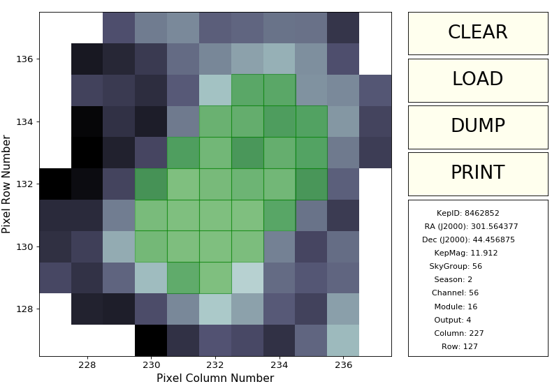
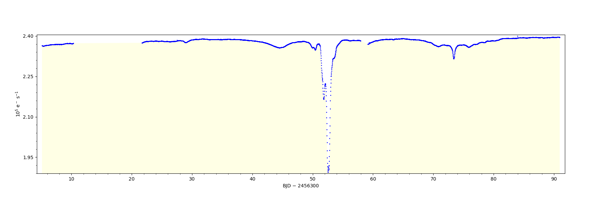

PyKE3: Kepler, K2 & TESS Data Analysis Tools
============================================
|pypi-badge| |ci-badge| |doc-badge| |bib-badge|

.. |pypi-badge| image:: https://img.shields.io/pypi/v/pyketools.svg
                :target: https://pypi.python.org/pypi/pyketools
.. |ci-badge| image:: https://travis-ci.org/KeplerGO/PyKE.svg?branch=master
              :target: https://travis-ci.org/KeplerGO/PyKE
.. |doc-badge| image:: https://readthedocs.org/projects/pyke/badge/?version=latest
              :target: https://pyke.readthedocs.io
.. |bib-badge| image:: https://img.shields.io/badge/NASA%20ADS-2012ascl.soft08004S-brightgreen.svg
              :target: http://adsabs.harvard.edu/abs/2012ascl.soft08004S

**Developed since 2012, PyKE offers a user-friendly way to inspect and analyze
the pixels and lightcurves obtained by NASA's Kepler, K2, and TESS missions.**

Documentation
-------------

Documentation is hosted at `pyke.readthedocs.io <https://pyke.readthedocs.io>`_.

What's new in PyKE v3? (July 2017)
----------------------------------

PyKE3 is the latest generation of the Kepler/K2/TESS toolkit.
It provides the following key improvements:

* PyKE is now a true Python package installable via `pip`;
* tasks are now added to the path as unix-style command-line tools;
* both Python 2 and 3 are now supported;
* PyKE no longer depends on PyRAF and is TESS-ready.

Example use
-----------

With PyKE, you can directly visualize frames from a target pixel file.
For example, let's visualize the frame number 100 for target KIC008462852
(a.k.a. Taby's Star)::

    $ kepmask kplr008462852-2013098041711_lpd-targ.fits.gz 100 --maskfile tabystar.txt

``kepmask`` is an interactive tool that allows one to create an arbitrary
aperture mask which can be subsequently be used in another ``pyke`` tool,
such as ``kepextract``.

``kepextract`` performs simple aperture photometry in the pixels given by the mask
created by ``kepmask``::

    $ kepextract kplr008462852-2013098041711_lpd-targ.fits.gz tabys-lc.fits --maskfile tabystar.txt

To visualize the light curve, you may want to use ``kepdraw``::

    $ kepdraw taby-lc.fits

Installation
------------

If you have a working version of Python 2 or 3 on your system
(we recommend `Anaconda Python <https://www.continuum.io/downloads>`_),
you can simply install the latest stable release of PyKE using ``pip``::

    $ pip install pyketools

Alternatively, if you want to experiment with the latest development version of
PyKE, you can install it straight from GitHub::

    $ git clone https://github.com/KeplerGO/PyKE.git
    $ cd PyKE
    $ pip install -e .

Note: PyKE version 2 and older, which was in use between 2012 and 2016 and
required PyRAF, is available in the branch ``py27-pyraf``. If you want to use
PyKE2 within PyRAF, we recommend getting it through the `AstroConda channel <http://astroconda.readthedocs.io/en/latest/installation.html#iraf-install>`_.

Acknowledgement
---------------

If you find this code useful in your research, please consider `citing <http://adsabs.harvard.edu/abs/2012ascl.soft08004S>`_::

    Title: PyKE: Reduction and analysis of Kepler Simple Aperture Photometry data
    Authors: Still, Martin; Barclay, Tom
    Publication: Astrophysics Source Code Library, record ascl:1208.004
    Publication Date: 08/2012

*This package is developed by Martin Still, Tom Barclay, Ze Vinicius, Geert Barentsen, Michael Gully-Santiago, Ann Marie Cody, and Christine Hedges for the Kepler/K2 GO Office.*

Contributing
------------

Users are welcome to open `issues <https://github.com/KeplerGO/PyKE/issues>`_ or `pull requests <https://github.com/KeplerGO/PyKE/pulls>`_.
You can also contact the development team via keplergo@mail.arc.nasa.gov
