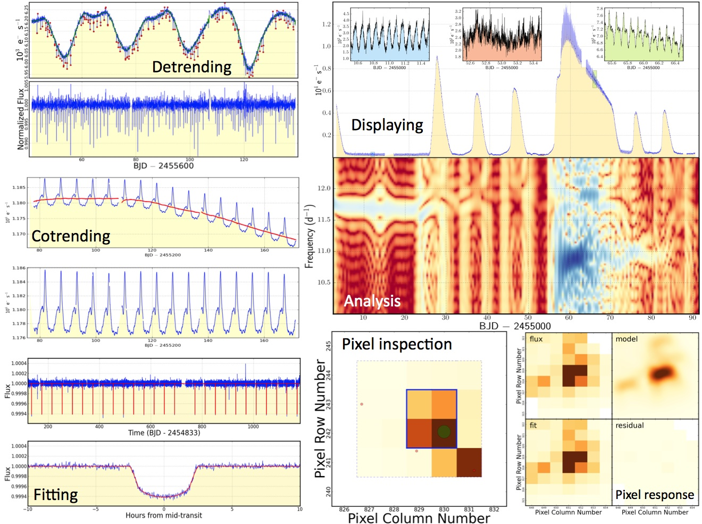

..

===========================================
PyKE: Kepler, K2 & TESS Data Analysis Tools
===========================================

Welcome to the PyKE documentation! PyKE is a set of data analysis tools which offer a user-friendly way to inspect and analyze the pixels and lightcurves obtained by NASA's Kepler, K2, and TESS missions.

*******************
:doc:`whatsnew/3.0`
*******************

.. _user-docs:

*************
Documentation
*************

.. toctree::
   :maxdepth: 1

   quickstart
   install
   overview
   contributing

*********
Tutorials
*********

.. toctree::
    :maxdepth: 2

    tutorials/index

**************
Acknowledgment
**************

PyKE is maintained by the Kepler/K2 Guest Observer Office.
Issues and contributions are welcome via the `GitHub repository <https://github.com/KeplerGO/PyKE>`_.
