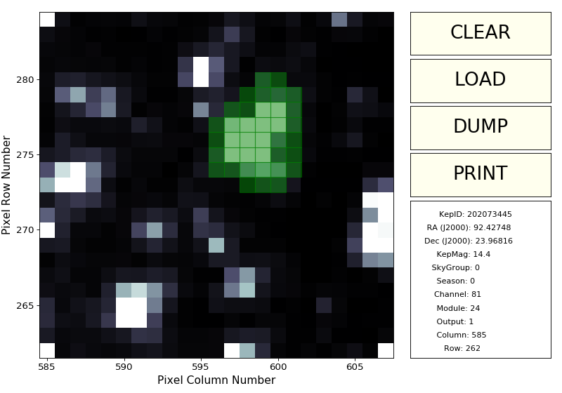
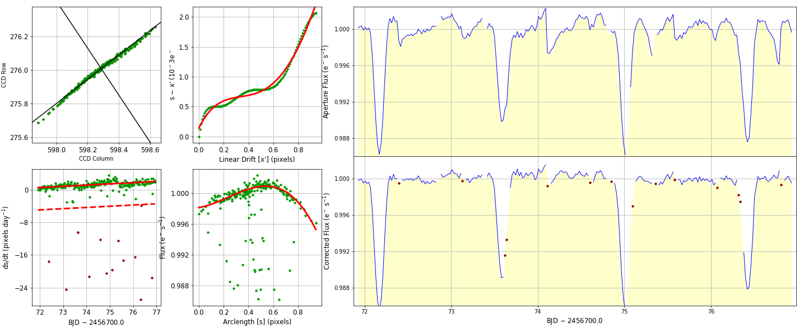

..

Example 1: Aperture photometry on a K2 target
=============================================

Step 1: Define a pixel extraction mask for a K2 target
------------------------------------------------------

We can use ``kepmask`` to generate a mask for our target of interest.
This mask will be later used to define a photometric extraction aperture.
The information about the aperture is stored in an ASCII file called
``maskfile.txt`` (this name can be changed using the ``--maskfile`` option).
The required arguments for this tool are the name of the target pixel file
(TPF) and the frame number.

.. code-block:: bash

    $ kepmask ktwo202073445-c00_lpd-targ.fits.gz --frameno 3000

Step 2: Extract the light curve from the pixel aperture just defined
--------------------------------------------------------------------

After creating a mask, we are able to extract a light curve for the target
using the ``kepextract`` tool. The basic arguments needed for ``kepextract``
are the tpf name and a name for the output file. Optionally, we can subtract
the background flux using the option ``--bkg`` and more importantly, we want
to pass our mask created in the previous step.

.. code-block:: bash

    $ kepextract ktwo202073445-c00_lpd-targ.fits.gz --maskfile maskfile.txt
    $ kepdraw ktwo202073445-c00_lpd-targ-kepextract.fits

.. image:: ../_static/images/tutorials/example_e/kepextract.png

Step 3: Detrend the light curve for low-frequency structure
-----------------------------------------------------------

First, let's clip our light curve to only include the part of our interest.
That can be done with ``kepclip``. To remove the low-frequency signals in our
light curve, we can use the ``kepflatten`` tool as follows:

.. code-block:: bash

    $ kepclip ktwo202073445-c00_lpd-targ-kepextract.fits 2456728.4110787315, 2456771.907224878

    $ kepflatten ktwo202073445-c00_lpd-targ-kepextract-kepclip.fits --datacol SAP_FLUX --errcol SAP_FLUX_ERR --stepsize 0.2 --winsize 3.0 --npoly 2 --niter 10 --plot --verbose

    $ kepdraw ktwo202073445-c00_lpd-targ-kepextract-kepclip-kepflatten.fits --datacol DETSAP_FLUX

.. image:: ../_static/images/tutorials/example_e/kepflatten.png

Step 4: Perform a photometric correction for motion systematics
---------------------------------------------------------------

To account for the motion of the spacecraft and remove those systematics, we
can use the ``kepsff`` tool. This tool attempts to identify those centroids in
the campaign time series that characterize the spacecraft motion
most-accurately and identify those detrended flux measurements that yield the
most consistent variability on the timescale of spacecraft roll. A
parameterized relationship between the two provides a series of photometric
correction factors.

.. code-block:: bash

    $ kepsff ktwo202073445-c00_lpd-targ-kepextract-kepclip-kepflatten.fits --datacol DETSAP_FLUX --stepsize 5. --npoly_ardx 4 --sigma_dsdt 10. --overwrite

    $ kepdraw ktwo202073445-c00_lpd-targ-kepextract-kepclip-kepflatten-kepsff.fits--datacol DETSAP_FLUX

.. image:: ../_static/images/tutorials/example_e/kepsff_lc.png

If the option ``--plot`` is used in ``kepsff``, a plot like the below is
generated.

The four square panels measure the magnitude of motion, identifying motion
outliers and thruster firings, before parameterizing the observed correlation
between motion and detrended flux (lower-middle panel). The right-hand panels
compare detrended aperture flux with it's corrected counterpart. A series of
such corrections and plots are made, one for each time window requested.
