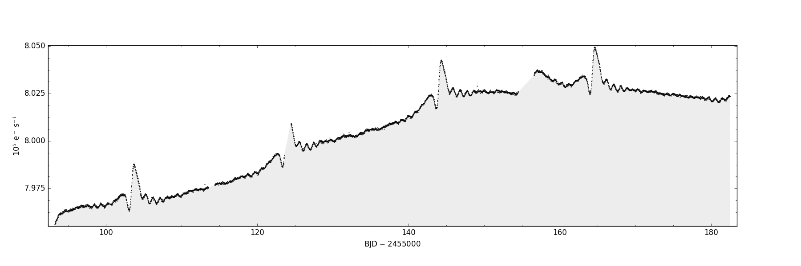
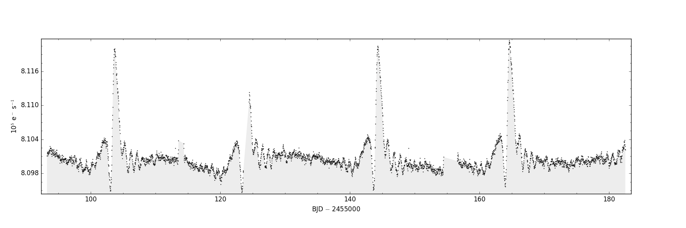
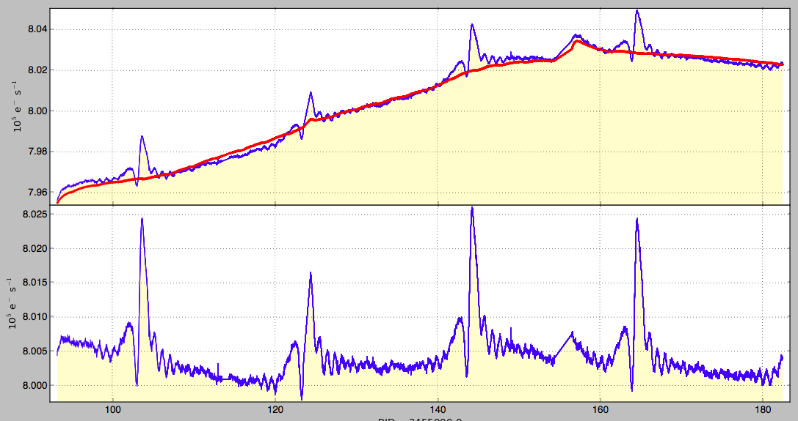
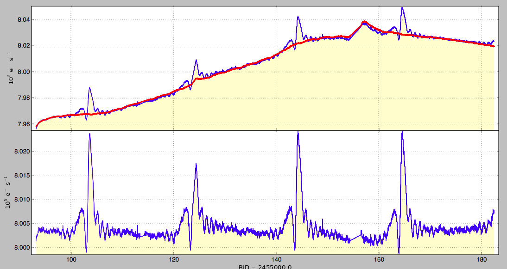
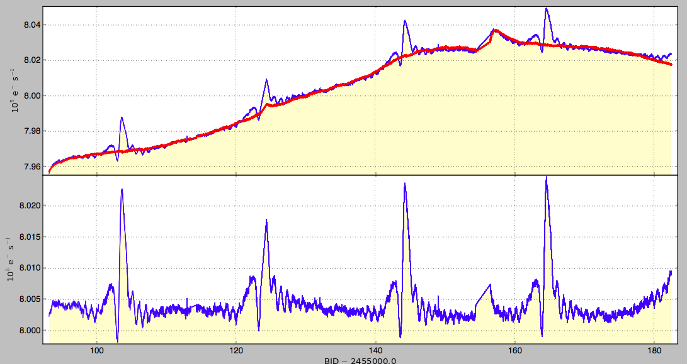
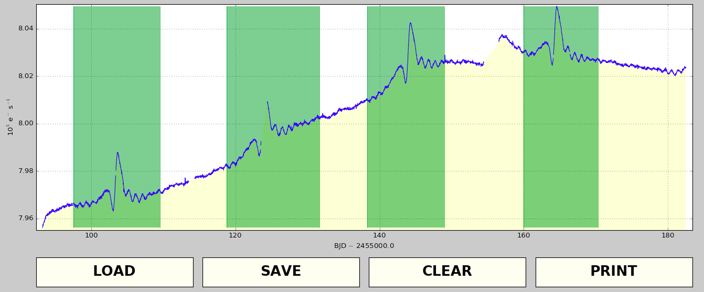
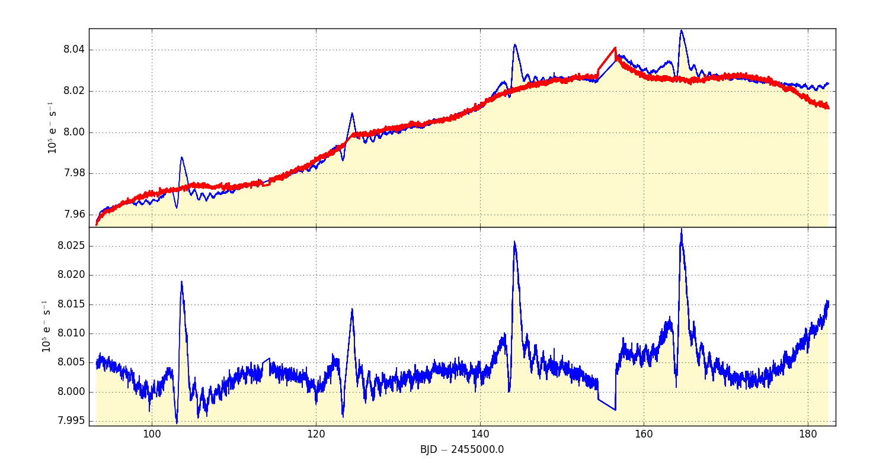

..

Example 1: Use cotrending basis vectors to remove systematic artifacts
======================================================================

In this example we will reduce the systematic trends present in the quarter 3 SAP time-series of an eccentric ('heartbeat') 
binary star, KIC 3749404. The presence of substantial astrophysical variability requires a careful (and somewhat
subjective) attention to the cotrending process.

Step 1: Plot archived SAP data
------------------------------------------------------

The Kepler pipeline has processed data for all targets, and the resulting light curves are available
from the MAST archive. We can download the FITS file containing the quarter 3 Kepler light
for the `target <https://archive.stsci.edu/kepler/preview.php?dsn=KPLR003749404-2009350155506&type=LC>`_.

First we check what the SAP light curve looks like by plotting it with ``kepdraw``.

.. code-block:: bash

    $ kepdraw kplr003749404-2009350155506_llc.fits

Step 2: Plot archived PDCSAP data
--------------------------------------------------------------------
Next, we can we render the same data after systematic artifact mitigation by the Kepler pipeline's PDC module. The cotrending 
basis vectors have been fit and subtracted by the PDC module to largely remove systematic structure within the light curve.

.. code-block:: bash

    $ kepdraw kplr003749404-2009350155506_llc.fits --datacol 'PDCSAP_FLUX'

Step 3: Fit and subtract 2 basis vectors from SAP light curv
-----------------------------------------------------------

The quarter 3 CBV file, kplr2009350155506-q03-d04 lcbv.fits, can be downloaded from the 
`Kepler archive at MAST <http://archive.stsci.edu/kepler/cbv.html>`_. To fit the first two 
quarter 3 CBVs to the quarter 3 data, use the ``kepcotrend`` task:

.. code-block:: bash

    $ kepcotrend kplr003749404-2009350155506_llc.fits kepcotrend.fits kplr2009350155506-q03-d25_lcbv.fits 1,2 --sigmaclip 3.0 --plot

The llsq method requires kepcotrend to perform a linear least-squares fit and subtraction of the basis vectors from the SAP data.
The full content of the input light curve file is copied to the output file and a new column called CBVSAP_FLUX is appended to 
the FITS table containing the best-fit, CBV-subtracted light curve. 

The result shown yields an improvement over the photometric quality of the SAP light curve. The long-term trend has been greatly 
reduced, but there are still higher-frequency features that are most likely systematic, and the fit can be improved further.

Step 4: Fit and subtract 5 basis vectors from SAP light curve
---------------------------------------------------------------

Now we perform another fit using five basis vectors. Overwrite any pre-existing file called kepcotrend.fits.

.. code-block:: bash

    $ kepcotrend kplr003749404-2009350155506_llc.fits kepcotrend.fits kplr2009350155506-q03-d25_lcbv.fits 1,2,3,4,5 --sigmaclip 3.0 --plot --overwrite

This new result is a qualitative improvement compared to the two-CBV fit, but the solution is still does not approach the 
orbit-repeatibility found in the archived PDCSAP light curve.

Step 5: Fit and subtract 8 basis vectors from SAP light curve
---------------------------------------------------------------

Now we perform a further fit the SAP data, this time using eight basis vectors. 

.. code-block:: bash

    $ kepcotrend kplr003749404-2009350155506_llc.fits kepcotrend.fits kplr2009350155506-q03-d25_lcbv.fits 1,2,3,4,5,6,7,8 --sigmaclip 3.0 --plot --overwrite

The result appears to be less optimal than the 5 basis vector fit. Anomalous structure has been added to the resulting time series 
by high-order CBVs. Least-square fitted CBVs never approach the archived PDCSAP data regardless of the number of CBVs in the fit 
ensemble. Eight basis vectors are over-fitting the periodic bright events and adding new systematic noise to the intervals 
between them. The pipeline PDC module combats many such situations in the Kepler archive by fitting CBV coefficients 
simultaneously to the target and a sample of target near-neighbors on the detector plane. The quietest targets in the locality 
provide the greatest weight in the fit minimization. The PyKE approach is different - rather than analyzing target samples, PyKE 
provides the flexibility to tune data reduction to target specific data quality and science optimization. In the PyKE paradigm, 
users have the ability to try different fit minimization methods, reject photometric outliers and ignore individual timestamps 
during fit minimization.

Step 6: Select time intervals to be ignored during cotrending
---------------------------------------------------------------

The quality of the CBV fit will improve if we mask time intervals of rapid astrophysical variability. Masked intervals are defined using the task 
``keprange``. This will plot the SAP FLUX column data within the light curve file over time. Ranges in time can be defined by selecting start and stop 
times by clicking with the mouse. Each masked range will fill in with green. If this does not work, you may need to change your python backend
to 'TkAgg'. This is accomplished by editing the file matplotlibrc in your site-packages/matplotlib/mpl-data directory.

    $ keprange kplr003749404-2009350155506_llc.fits keprange.txt --column SAP_FLUX

We masked four ranges in this example and these ranges will be saved to a text file after clicking the ‘SAVE’ button on the interactive GUI.

Step 7: Fit and subtract 8 basis vectors from SAP light curve with filtering
-------------------------------------------------------------------------------------

We perform the eight basis vector fit one last time, excluding from the fit the regions defined during the `keprange` task, again using 
`kepcotrend'. 

.. code-block:: bash

    $ kepcotrend kplr003749404-2009350155506_llc.fits kepcotrend.fits kplr2009350155506-q03-d25_lcbv.fits 1,2,3,4,5,6,7,8 --sigmaclip 3.0 --maskfile keprange.txt --plot --overwrite

In terms of repeatibility, an individually-filtered call to `kepcotrend` has provided an improvement in quality over the pipeline's 
PDC module. The most conspicuous remaining artifacts coincide with the thermal settling events after each of the three Earth-points 
during the quarter.

