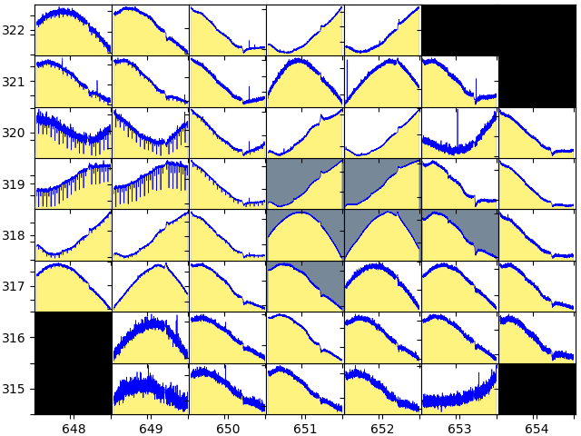

..

Extract and Cotrend New Light Curves from Target Pixel Files
============================================================

Let's first download the archived light curve for the target KIC 2449074:

.. code-block:: bash

    $ wget http://archive.stsci.edu/missions/kepler/lightcurves/0024/002449074/kplr002449074-2009350155506_llc.fits

Step 1: Plot archived SAP data
------------------------------

We can visualize the simple aperture photometry flux using ``kepdraw``:

.. code-block:: bash

    $ kepdraw kplr002449074-2009350155506_llc.fits

.. image:: ../_static/images/tutorials/example_a/kepdraw_sap.png
    :align: center

Step 2: Plot archived PDCSAP data
---------------------------------

Kepler's pipeline is able to remove systematic artifacts thorugh the Presearch
Data Conditioning (PDC). The corrected light curve can be visualized with
``kepdraw`` by passing the desired keyword through ``--datacol`` argument:

.. code-block:: bash

    $ kepdraw kplr002449074-2009350155506_llc.fits --datacol PDCSAP_FLUX

.. image:: ../_static/images/tutorials/example_a/kepdraw_pdcsap.png
    :align: center

Step 3: Plot archived photometric time-series for individual target pixels
--------------------------------------------------------------------------

The next figure shows a calibrated flux time series of each target mask pixel
collected over Q3. This figure was produced with the PyKE task ``keppixseries``
operating upon the TPF *kplr002449074-2009350155506_lpd-targ.fits*, as follows:

.. code-block:: bash

    $ keppixseries kplr002449074-2009350155506_lpd-targ.fits.gz keppixseries.fits
    --plotfile keppixseries.png --plottype local

The figure reveals unambiguously that the target star is not the source of the
"transit" features. A background eclipsing binary star is situated 10 arcsec
from the target star (2.5 pixels to the left of KIC 2449074 on the figure) and
is leaking into the optimal aperture.

Step 4: Define new optimal apertures for target and background binary star
--------------------------------------------------------------------------

By extracting the light curve manually using different pixels, we can either
reduce the contaminating flux from the eclipsing binary in the target light
curve or, alternatively, extract a separate light curve from the eclipsing
binary. New mask files are created interactively from the TPF
*kplr002449074-2009350155506_lpd-targ.fits* using the ``kepmask`` tool.
The primary output from ``kepmask`` is an ASCII file defining the selected
pixel aperture. The image associated with the 2,177th timestamp in the Target
Pixel File is plotted on a linear intensity scale as follows:

.. code-block:: bash

    $ kepmask kplr002449074-2009350155506_lpd-targ.fits.gz 2177 --maskfile mask_target.txt
    --iscale linear

.. image:: ../_static/images/tutorials/example_a/kepmask_target.png
    :align: center
