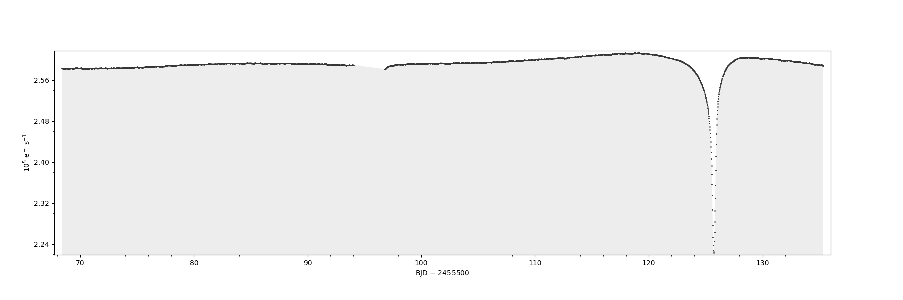
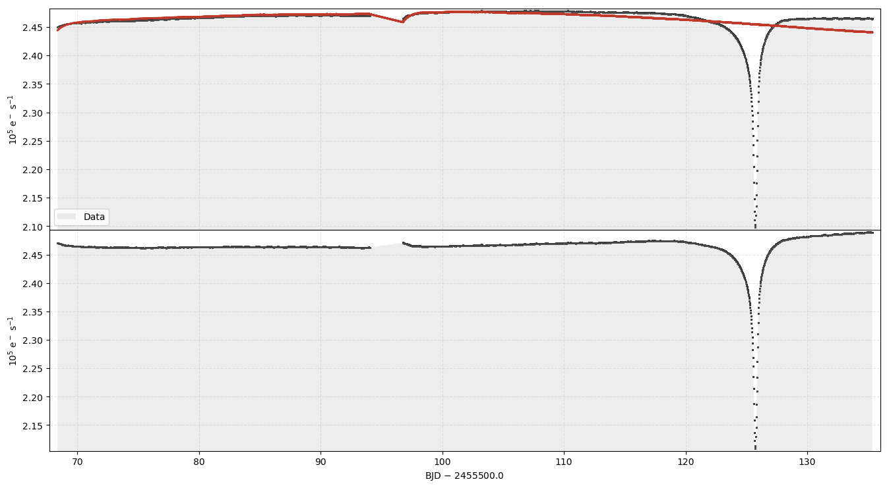
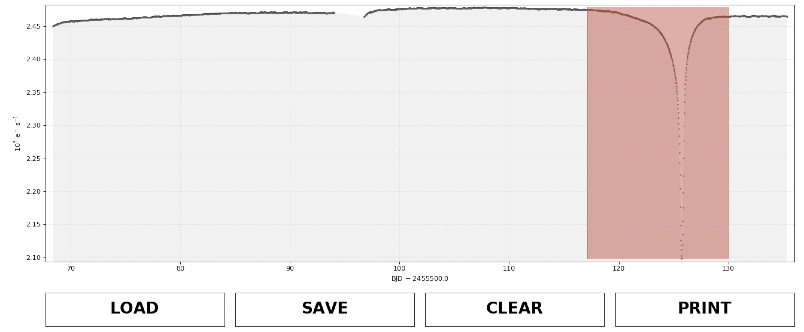
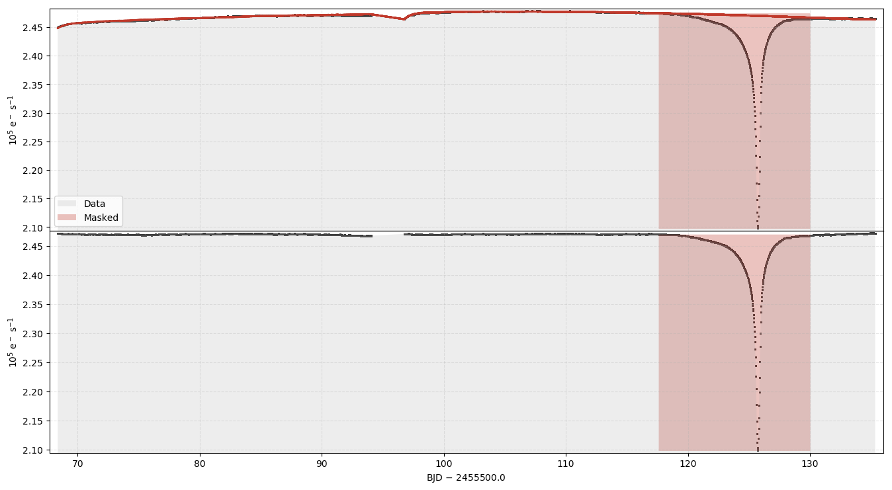
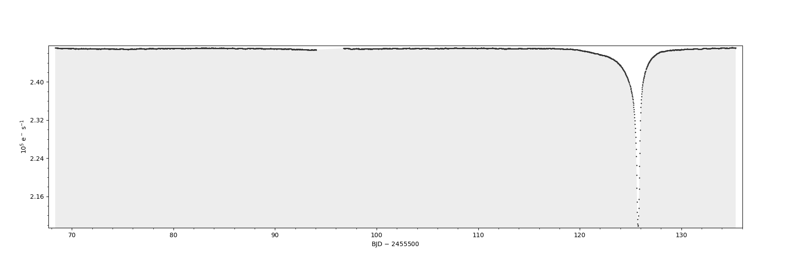

Example 5: Fitting CBVs to Remove Long Term Trends
==================================================

What are CBVs
~~~~~~~~~~~~~

Cotrending Basis Vectors are used to remove long term trends in light
curves. They are built from the most common trends observed in each
channel. You can read more about CBVs in `Demystifying Kepler
Data <https://arxiv.org/pdf/1207.3093.pdf>`__. They can be used to clean
lightcurves of common trends experience by all targets.

*kepcotrend* can be used to remove CBVs from a light curve. The new
light curve is put in a new extention to the fits file.

Below is an example workflow to remove CBVs from a supernova light curve
in *Kepler*. The first stage is to obtain both the light curve and the
CBV file for that quarter. (You can download CBVs
`here <https://archive.stsci.edu/kepler/cbv.html>`__ for Kepler and
`here <https://archive.stsci.edu/ktwo/cbv.html>`__ for K2.)

.. code:: ipython3

    !wget https://archive.stsci.edu/missions/kepler/lightcurves/0084/008462852/kplr008462852-2011073133259_llc.fits

.. parsed-literal::

    --2017-10-23 17:12:41--  https://archive.stsci.edu/missions/kepler/lightcurves/0084/008462852/kplr008462852-2011073133259_llc.fits
    Resolving archive.stsci.edu... 130.167.252.39
    Connecting to archive.stsci.edu|130.167.252.39|:443... connected.
    HTTP request sent, awaiting response... 200 OK
    Length: 357120 (349K) [text/plain]
    Saving to: ‘kplr008462852-2011073133259_llc.fits.1’

    kplr008462852-20110 100%[===================>] 348.75K   472KB/s    in 0.7s

    2017-10-23 17:12:43 (472 KB/s) - ‘kplr008462852-2011073133259_llc.fits.1’ saved [357120/357120]

.. code:: ipython3

    !wget https://archive.stsci.edu/missions/kepler/cbv/kplr2011073133259-q08-d25_lcbv.fits

.. parsed-literal::

    --2017-10-23 17:13:03--  https://archive.stsci.edu/missions/kepler/cbv/kplr2011073133259-q08-d25_lcbv.fits
    Resolving archive.stsci.edu... 130.167.252.39
    Connecting to archive.stsci.edu|130.167.252.39|:443... connected.
    HTTP request sent, awaiting response... 200 OK
    Length: 21925440 (21M) [application/fits]
    Saving to: ‘kplr2011073133259-q08-d25_lcbv.fits.1’

    kplr2011073133259-q 100%[===================>]  20.91M   297KB/s    in 62s

    2017-10-23 17:14:06 (343 KB/s) - ‘kplr2011073133259-q08-d25_lcbv.fits.1’ saved [21925440/21925440]

We can plot up the light curve using kepdraw. We've downloaded quarter 8
of KIC 8462852, which undergos large flux dips over time periods of a
few days. kepdraw will plot the light curve and save it to
*kplr008462852-2011073133259\_llc-kepdraw.png*

.. code:: bash

    %%bash
    kepdraw kplr008462852-2011073133259_llc.fits --non-interactive

.. parsed-literal::

    Found the following flux columns: SAP_FLUX, SAP_FLUX_ERR, PDCSAP_FLUX, PDCSAP_FLUX_ERR
    Using data column PDCSAP_FLUX on the plot...
    Writing output file kplr008462852-2011073133259_llc-kepdraw.png...

Now let's use kepcotrend to remove the CBVs from the light curve. It is
up to the user to determine how many CBVs should be fit; too few and
there will be residual trends, too many and the lightcurve will be
overfit, removing astrophysical data. We'll use the first two for this
star.

kepcotrend takes in the lightcurve file name, the CBV file name and a
list of CBVs to use. (We are using '1 2'.) The results are two
coefficients for each of the CBVs and a png image of the fit.

.. code:: bash

    %%bash
    kepcotrend kplr008462852-2011073133259_llc.fits kplr2011073133259-q08-d25_lcbv.fits '1 2' --plot \
    --overwrite --non-interactive --outfile out.fits

.. parsed-literal::

    Writing output file kplr008462852-2011073133259_llc-kepcotrend.fits...
          -----
    reduced chi2: 51658.12955052195
    rms: 3357.82526764298
    Coefficient of CBV #1: [ 0.03127181]
    Coefficient of CBV #2: [-0.21461379]
          -----

That seems to have fit very poorly. Unfortunately the CBVs are being fit
to the large dip in flux and this is causing a very poor fit. We can
mask out this feature using keprange. Using the call below a window will
pop up and allow the user to select a time range. keprange will save a
text file containing those time stamps.

You should see an interface pop up that looks like the following
|image0|

.. code:: bash

    %%bash
    keprange kplr008462852-2011073133259_llc.fits --overwrite

.. parsed-literal::

    2455617.56890755,2455630.0185563867

    Wrote ASCII file kplr008462852-2011073133259_llc-keprange.txt

Now we can pass kepcotrend the range file and it will fit the CBVs
ignoring these data points. It will then apply the correction to all
datapoints. This is shown below.

.. code:: bash

    %%bash
    kepcotrend kplr008462852-2011073133259_llc.fits kplr2011073133259-q08-d25_lcbv.fits '1 2' --plot \
    --overwrite --non-interactive --outfile out.fits --maskfile kplr008462852-2011073133259_llc-keprange.txt

.. parsed-literal::

    Writing output file out.fits...
          -----
    reduced chi2: 7079.055789270921
    rms: 1278.6256990911806
    Coefficient of CBV #1: [-0.09308594]
    Coefficient of CBV #2: [-0.09540007]
          -----

kepcotrend has made a new fits file and added a new flux column to the
first extention called 'CBVSAP\_FLUX'. We can plot up this new, CBV
corrected flux using kepdraw and check that it has been corrected. This
is below and the long term trends have been successfully removed.

.. code:: bash

    %%bash
    kepdraw out.fits --non-interactive --datacol CBVSAP_FLUX

.. parsed-literal::

    Writing output file out-kepdraw.png...

