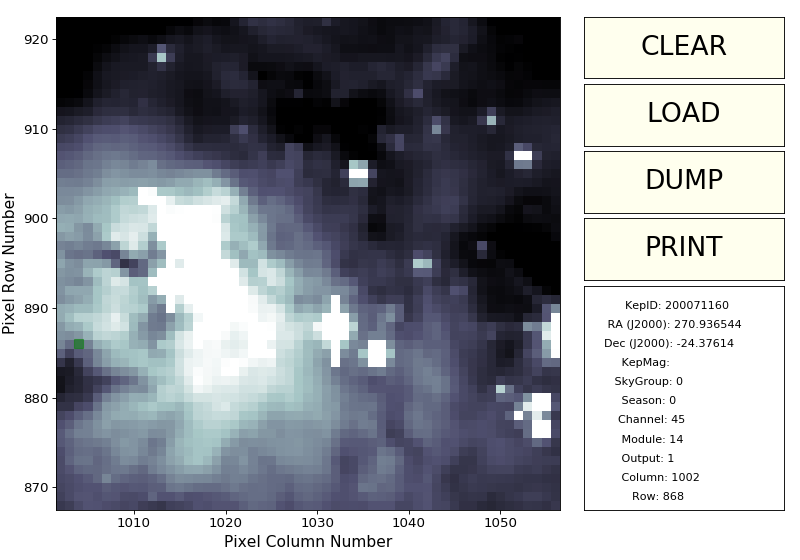

..

Performing PSF photometry in a K2 cluster
=========================================

In this tutorial we will use PSF-fitting photometry to create a light curve
for an object in one of the cluster superstamps observed by K2.

For this purpose, we download on of the target pixel files which K2
obtained towards the Lagoon Nebula (M8) during `Campaign 9a <https://keplerscience.arc.nasa.gov/k2-c9.html>`_:

.. code-block:: bash

    $ wget http://archive.stsci.edu/missions/k2/target_pixel_files/c91/200000000/71000/ktwo200071160-c91_lpd-targ.fits.gz

We can visualize one of the frames using ``kepmask``:

.. code-block:: bash

    $ kepmask ktwo200071160-c91_lpd-targ.fits.gz 0

We would like to create a light curve for the target located near
pixel (1013, 918) in the detector.

First, we use ``keptrim`` to create a smaller target pixel file
by cutting a 3x3 mask around the center of our target:

.. code-block:: bash

    $ keptrim ktwo200071160-c91_lpd-targ.fits.gz ktwo200071160-c91_trimmed_3.fits 1013 918 3

This command creates a new target pixel file called ``ktwo200071160-c91_trimmed_3.fits`` in the current directory,
which contains the desired pixels while preserving all the original metadata.

We can then use ``kepprfphot`` to fit the Kepler PRF for every frame in our trimmed tpf:

.. code-block:: bash

    $ kepprfphot ktwo200071160-c91_lpd-targ-trimmed_3.fits  ktwo200071160-c91_trimmed_3_prfphot --columns 1013 --rows 918 --fluxes 18000 --prfdir prf_dir --background --clobber --verbose

Note that `prf_dir` is either a relative or absolute path to a directory
containing the PRF files from the Kepler focal plane available in [#]_.

This command creates a fits file called ``ktwo200071160-c91_trimmed_3_prfphot_0.fits`` with all the results from
the prf photometry including fitted flux and centroids.

We can then write a small python script to see what the light curve looks like

.. code-block:: python

    from matplotlib import pyplot as plt
    from astropy.io import fits

    f = fits.open('ktwo200071160-c91_trimmed_3_prfphot_0.fits')
    plt.plot(f[1].data['TIME'], f[1].data['PSF_FLUX'], 'ko', markersize=1)
    plt.xlabel(r'Time')
    plt.ylabel(r'Flux $e^{-} s^{-1}$')
    plt.show()

.. image:: ../_static/images/tutorials/tpf2lc/lc.png
    :align: center

The low frequency components of our light curve can be removed with ``kepflatten``.

.. [#] Note that this tool requires the calibration files from the Kepler focal plane characteristics, which can downloaded here: http://archive.stsci.edu/missions/kepler/fpc/prf/
