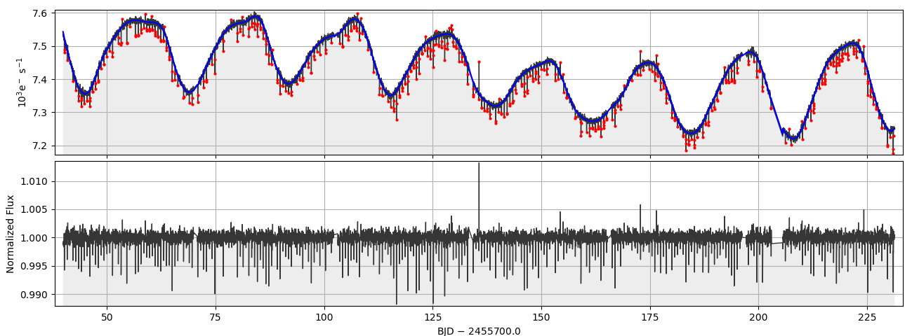

..

Example 4: Removing Stellar Astrophysics and Quarter Stitching
==============================================================

The purpose of this tutorial is to flatten both systematic artifacts and
astrophysical signal in order to fold candidate planet transits successfully
upon their orbital period and characterize them with a physical model.

For this purpose, we download quarter 10 and 11 of
`KIC 12557548 <http://archive.stsci.edu/kepler/preview.php?type=lc&dsn=KPLR012557548-2011271113734>`_:

.. code-block:: bash

    $ wget http://archive.stsci.edu/missions/kepler/lightcurves/0125/012557548/kplr012557548-2011271113734_llc.fits
    $ wget http://archive.stsci.edu/missions/kepler/lightcurves/0125/012557548/kplr012557548-2012004120508_llc.fits

We can use ``kepstitch`` to stitch those light curves together:

.. code-block:: bash

    $ kepstitch kplr012557548-2011271113734_llc.fits kplr012557548-2012004120508_llc.fits --outfile kplr012557548-kepstitch.fits

We can visualize the stitched light curve using kepdraw:

.. code-block:: bash

    $ kepdraw kplr012557548-kepstitch.fits
    $ kepdraw kplr012557548-kepstitch.fits --datacol PDCSAP_FLUX

.. image:: ../_static/images/tutorials/example_d/kplr012557548-kepstitch-kepdraw.png
.. image:: ../_static/images/tutorials/example_d/kplr012557548-kepstitch-kepdraw-pdcsap.png

With systematic artifacts already mostly-removed, the light curves need to be
flattened but in a way that does not radically contaminate the transit
profile with new systematic structure. The PyKE tool kepflatten fits piecemeal
low-order polynomials on small timeslices aross the time-series. Fitting makes
user of iterative σ-clipping that removes statistical outliers from a best-fit
before refitting until no more time-stamps are rejected. In this way, transits
profiles are conserved during the fit process and subsequent normalization by
the final best-fit. The flattened are written to the output file in two new
columns, DETSAP_FLUX and DETSAP_ERR_FLUX.

.. code-block:: bash

    $ kepflatten kplr012557548-kepstitch.fits --nsig 3 --stepsize 1 --npoly 2 --niter 10 --plot

Now, we can apply ``kepfold`` to fold our final light curve:

.. code-block:: bash

    $ kepfold kplr012557548-kepstitch-kepflatten.fits 0.653534 2455372.883 --threshold 3. --niter 5 --bindata --binmethod median --nbins 100 --plottype det

.. image:: ../_static/images/tutorials/example_d/kplr012557548-kepstitch-kepdraw-kepflatten-kepfold.png
