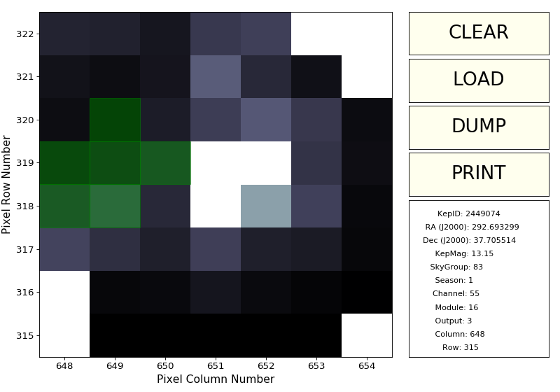

..

Example 3: Separating a background EB from a foreground star
============================================================

The likelihood of source confusion around any given target is high.
One cannot be certain whether astrophysical variability across a Kepler light curve comes entirely from the target star.
In order to resolve the sources of variability within a target mask,
users should examine the Target Pixel File (TPF).

Step 1: Plot archived SAP data
------------------------------

For the purposes of this example, we will examine the light curve and pixel file of KIC 2449074, which we can download from the archive as follows:

.. code-block:: bash

    $ wget http://archive.stsci.edu/missions/kepler/lightcurves/0024/002449074/kplr002449074-2009350155506_llc.fits

We can visualize the Simple Aperture Photometry (SAP) flux measured by the Kepler pipeline using the ``kepdraw`` tool:

.. code-block:: bash

    $ kepdraw kplr002449074-2009350155506_llc.fits

.. image:: ../_static/images/tutorials/example_a/kepdraw_sap.png
    :align: center

Step 2: Plot archived PDCSAP data
---------------------------------

Kepler's pipeline is able to remove systematic artifacts thorugh the Presearch
Data Conditioning (PDC). The corrected light curve can be visualized with
``kepdraw`` by passing the desired keyword through ``--datacol`` argument:

.. code-block:: bash

    $ kepdraw kplr002449074-2009350155506_llc.fits --datacol PDCSAP_FLUX

.. image:: ../_static/images/tutorials/example_a/kepdraw_pdcsap.png
    :align: center

Step 3: Plot archived photometric time-series for individual target pixels
--------------------------------------------------------------------------

The next figure shows a calibrated flux time series of each target mask pixel
collected over Q3. This figure was produced with the PyKE task ``keppixseries``
operating upon the TPF ``kplr002449074-2009350155506_lpd-targ.fits``, as follows:

.. code-block:: bash

    $ wget https://archive.stsci.edu/missions/kepler/target_pixel_files/0024/002449074/kplr002449074-2009350155506_lpd-targ.fits.gz

    $ keppixseries kplr002449074-2009350155506_lpd-targ.fits.gz
    --plotfile keppixseries.png --plottype local

.. image:: ../_static/images/tutorials/example_a/keppixseries.png
    :align: center

The figure reveals unambiguously that the target star is not the source of the
"transit" features. A background eclipsing binary star is situated 10 arcsec
from the target star (2.5 pixels to the left of KIC 2449074 on the figure) and
is leaking into the optimal aperture.

Step 4: Define new optimal apertures for target and background binary star
--------------------------------------------------------------------------

By extracting the light curve manually using different pixels, we can either
reduce the contaminating flux from the eclipsing binary in the target light
curve or, alternatively, extract a separate light curve from the eclipsing
binary. New mask files are created interactively from the TPF
``kplr002449074-2009350155506_lpd-targ.fits`` using the ``kepmask`` tool.
The primary output from ``kepmask`` is an ASCII file defining the selected
pixel aperture. The image associated with the 2,177th timestamp in the Target
Pixel File is plotted on a linear intensity scale as follows:

.. code-block:: bash

    $ kepmask kplr002449074-2009350155506_lpd-targ.fits.gz --frameno 2177 --maskfile mask_target.txt
    --iscale linear

.. image:: ../_static/images/tutorials/example_a/kepmask_target.png
    :align: center

Similarly, we can create an aperture mask for the eclipsing binary:

.. code-block:: bash

    $ kepmask kplr002449074-2009350155506_lpd-targ.fits.gz --frameno 2177 --maskfile mask_eb.txt
    --iscale linear

Step 5: Extract new SAP light curves from the TPF
-------------------------------------------------

The PyKE tool kepextract can be called to extract new SAP light curves from the TPF.
We can create two new light curves as follows:

.. code-block:: bash

    $ kepextract kplr002449074-2009350155506_lpd-targ.fits.gz --outfile kepextract_target.fits --maskfile mask_target.txt

    $ kepdraw kepextract_target.fits

.. image:: ../_static/images/tutorials/example_a/kepextract_target.png
    :align: center

.. code-block:: bash

    $ kepextract kplr002449074-2009350155506_lpd-targ.fits.gz --outfile kepextract_eb.fits --maskfile mask_eb.txt

    $ kepdraw kepextract_eb.fits

.. image:: ../_static/images/tutorials/example_a/kepextract_eb.png
    :align: center

Step 6: Mitigate for systematic artifacts in new SAP light curves
-----------------------------------------------------------------

The extracted light curves are constructed by simple pixel summation.
Consequently artifacts resulting from target motion across the pixel aperture
exist within the new light curves. Artifacts can be reduced or removed
by fitting and subtracting the best fit ensemble of Cotrending Basis Vectors
(CBVs). Users must ensure that they download CBVs from the MAST correctly
corresponding to the quarter being analyzed. In the current case, the Q3 CBV is
called ``kplr2009350155506-q03-d14_lcbv.fits``. Artifact correction is performed by
the ``kepcotrend`` tool. The corrected light curve is stored in an output file
within a new FITS column called CBVSAP_FLUX.

.. code-block:: bash

    $ kepcotrend kepextract_target.fits --outfile kepcotrend_target.fits
    ../cbv/kplr2009350155506-q03-d25_lcbv.fits 1,2,3,4,5,6 --sigmaclip 3.0 --plot

    $ kepcotrend kepextract_eb.fits --outfile kepcotrend_eb.fits
    ../cbv/kplr2009350155506-q03-d25_lcbv.fits 1,2,3,4,5,6 --sigmaclip 3.0 --plot

.. image:: ../_static/images/tutorials/example_a/kepcotrend_target.png
    :align: center

.. image:: ../_static/images/tutorials/example_a/kepcotrend_eb.png
    :align: center
