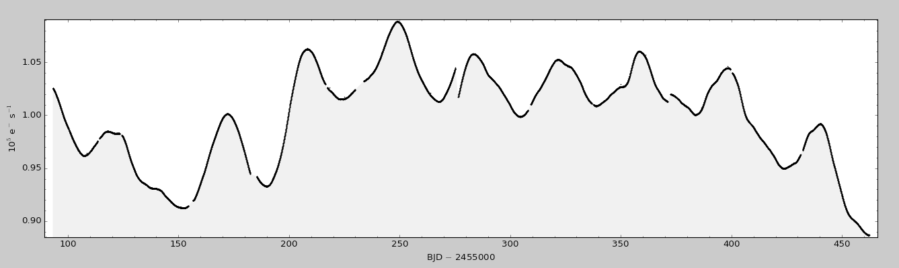
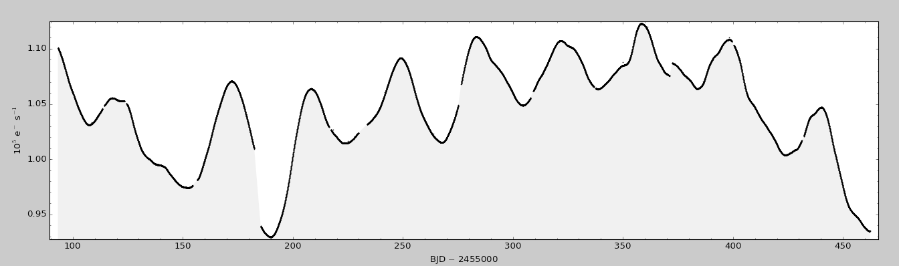

..

Example 4a: Seamlessly stitch together different quarters of a Kepler light curve 
======================================================================

In this example we will examine KIC 9603833. We can download the data for each quarter from the
`MAST archive <http://archive.stsci.edu/kepler/preview.php?type=lc&dsn=KPLR009603833-2011271113734>`_.

MAST gives the option to download all the light curves via a wget script, like so:

.. code-block:: bash

$ wget -q http://archive.stsci.edu/missions/kepler/lightcurves/0096/009603833/kplr009603833-2009350155506_llc.fits
$ wget -q http://archive.stsci.edu/missions/kepler/lightcurves/0096/009603833/kplr009603833-2010078095331_llc.fits
$ wget -q http://archive.stsci.edu/missions/kepler/lightcurves/0096/009603833/kplr009603833-2010174085026_llc.fits
$ wget -q http://archive.stsci.edu/missions/kepler/lightcurves/0096/009603833/kplr009603833-2010265121752_llc.fits

Step 1: Stitch the data from quarters 4 to 7 together
------------------------------------------------------

.. code-block:: bash

    $ kepstitch  kplr009603833-2009350155506_llc.fits kplr009603833-2010078095331_llc.fits kplr009603833-2010174085026_llc.fits kplr009603833-2010265121752_llc.fits

Step 2: Plot stitched SAP data
------------------------------------------------------

Next we check what the stitched SAP light curve looks like by plotting it with ``kepdraw``.

.. code-block:: bash

    $ kepdraw kepstitch.fits

Step 3: Plot stitched PDCSAP data
--------------------------------------------------------------------
Next, we can we render the same data after systematic artifact mitigation by the Kepler pipeline's PDC module. The cotrending 
basis vectors have been fit and subtracted by the PDC module to largely remove systematic structure within the light curve.
There is some improvement in the jumps between quarters, but they have not completely disappeared.

.. code-block:: bash

    $ kepdraw kepstitch.fits --datacol 'PDCSAP_FLUX'

Step 4: Make a new light curve version using all pixels in the target pixel files
--------------------------------------------------------------------------------------
Using the PDC pipeline light curves mitigated some of the gaps between quarters, but some remain. We can further reduce
their amplitude by extracting our own light curve using a large pixel mask. We do this with the task ``kepextract``
and the "maskfile=all" option.

First, we need to obtain the target pixel file[s] for quarters 4 to 7. Once again, MAST provides a wget script, like so:

.. code-block:: bash

$ wget -q http://archive.stsci.edu/missions/kepler/target_pixel_files/0096/009603833/kplr009603833-2009350155506_lpd-targ.fits.gz
$ wget -q http://archive.stsci.edu/missions/kepler/target_pixel_files/0096/009603833/kplr009603833-2010078095331_lpd-targ.fits.gz
$ wget -q http://archive.stsci.edu/missions/kepler/target_pixel_files/0096/009603833/kplr009603833-2010174085026_lpd-targ.fits.gz
$ wget -q http://archive.stsci.edu/missions/kepler/target_pixel_files/0096/009603833/kplr009603833-2010265121752_lpd-targ.fits.gz 

